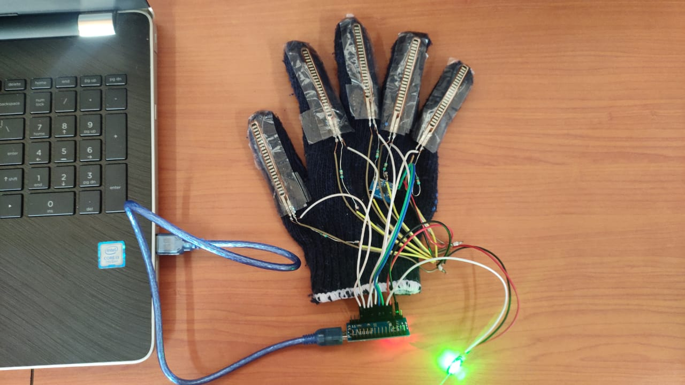
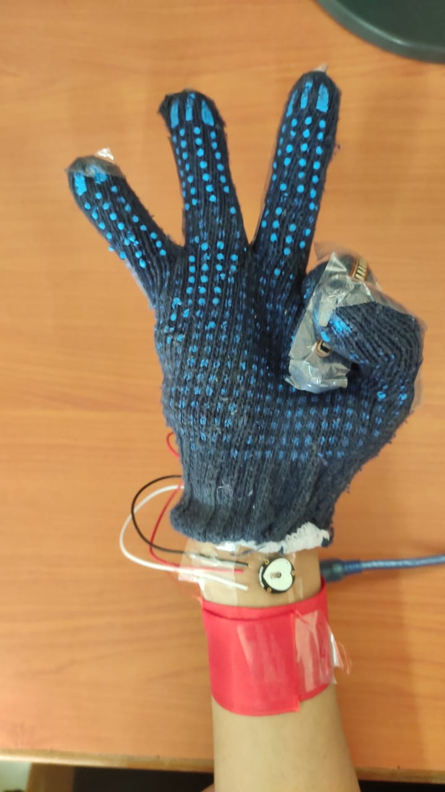
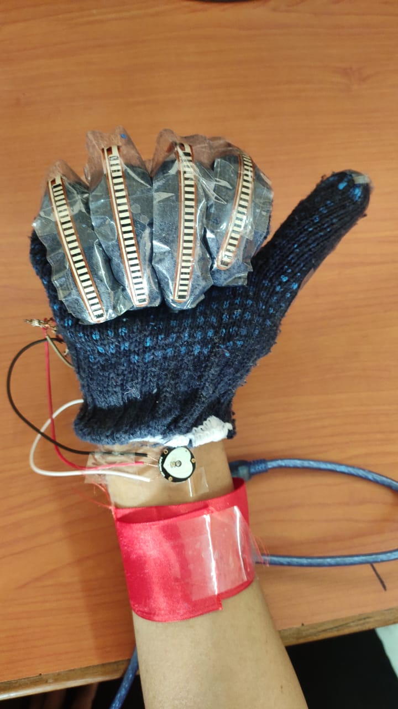
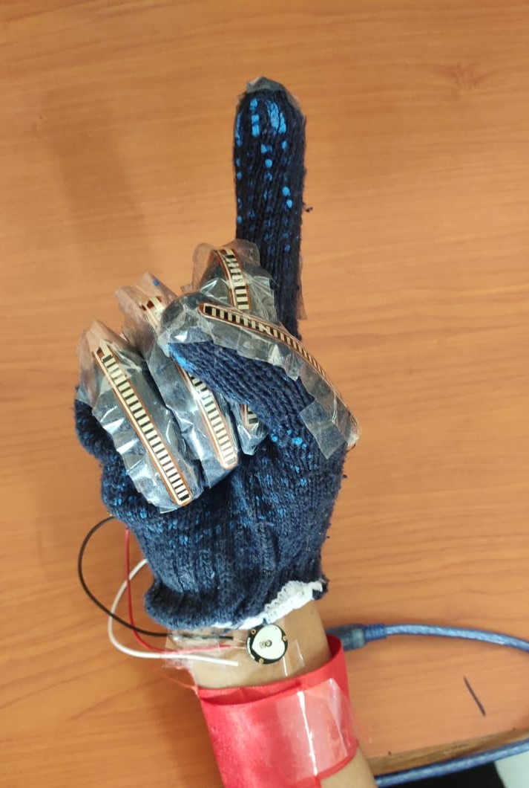

# Smart-glove
Arduino based Smart glove for deaf and mute people, that coverts sign language to text.

## What it does?
> Sign language is the medium through which we can communicate with deaf and dumb people. It is a non-verbal form of interaction which is found amongst deaf communities in the world. 

> We designed an improved sensing glove that will make the sign language understandable to everyone and also monitors the pulse rate. 

> Deaf-mute people can easily communicate using this glove. 

> This project converts Sign to text (basic commands) and monitors the pulse rate. 

> The glove is equipped with flex sensors, an accelerometer, pulse sensor which is further connected to Arduino NANO. 

> Serial Monitor of Arduino IDE is used to display result on the basis of specific gestures.

#### An .ino file is attached for your reference. To know more about how to use it check [here](https://file.org/extension/ino).

#### Glove:

#### Signs: 

 &nbsp; &nbsp; &nbsp;  &nbsp; &nbsp; &nbsp;  &nbsp;
